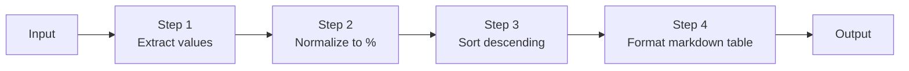
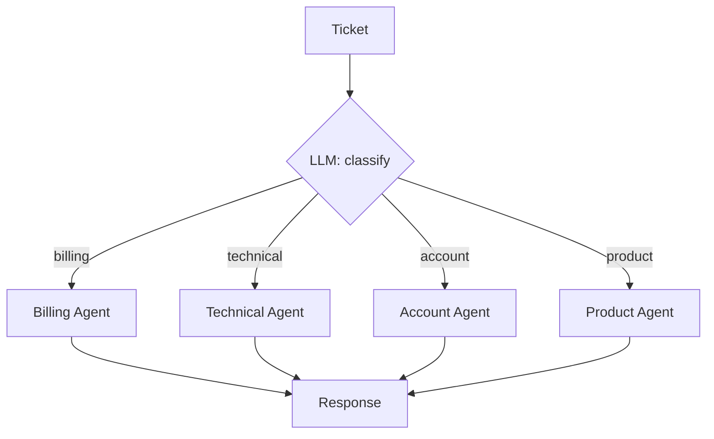
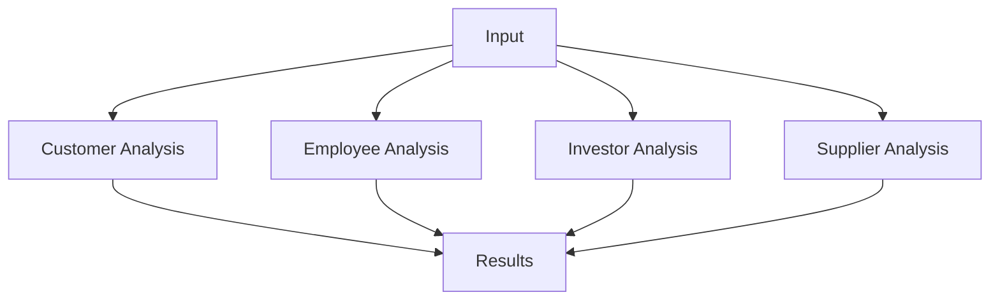
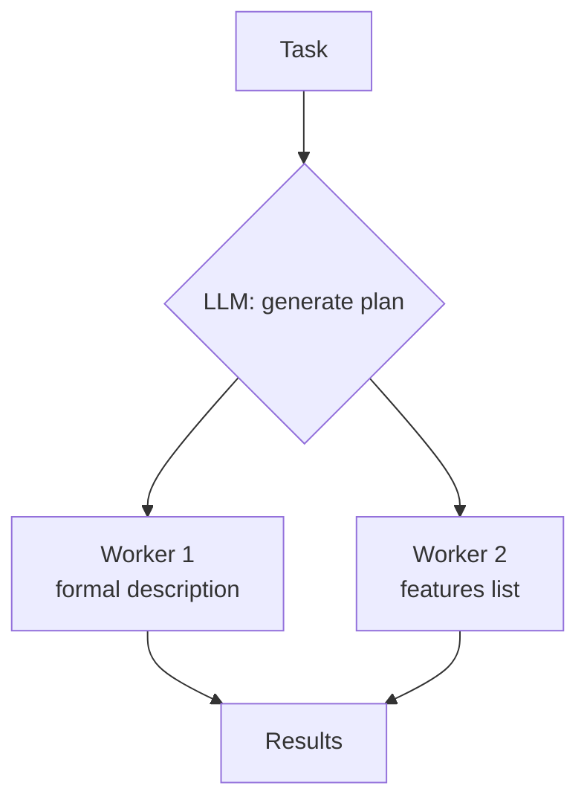
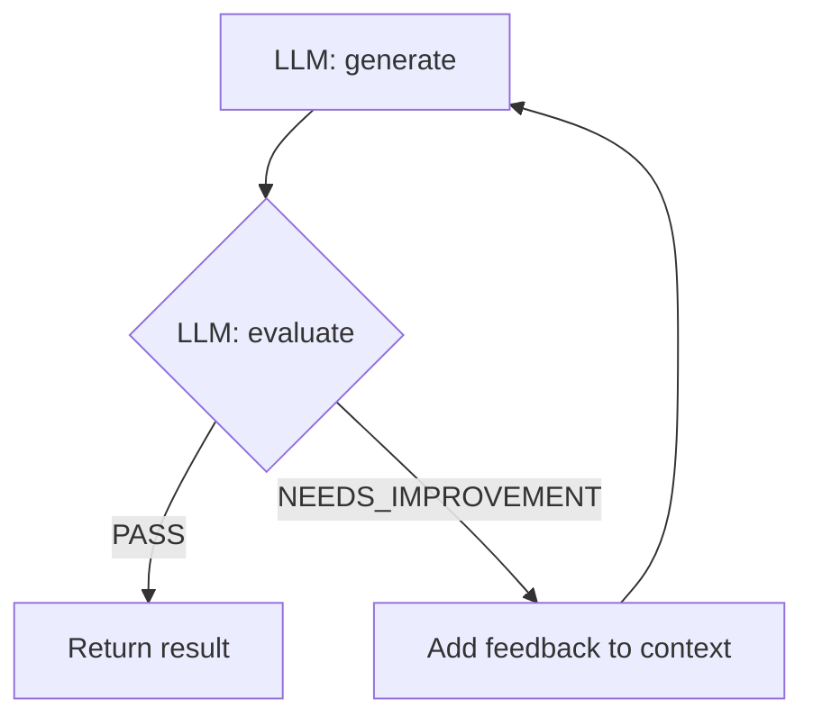
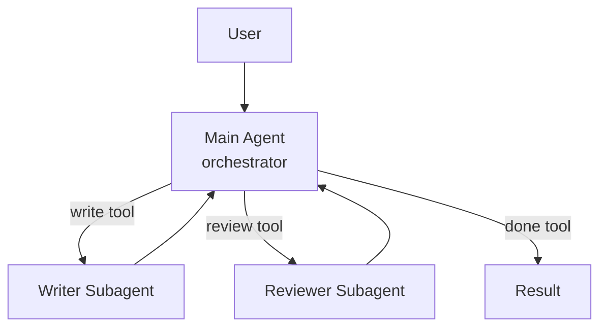
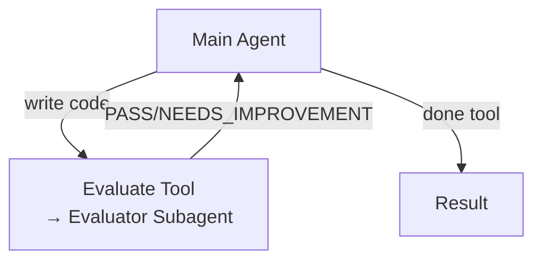

# Building Effective Agents with AI SDK

TypeScript port of the agentic patterns from
[Building Effective Agents](https://www.anthropic.com/research/building-effective-agents)
by Anthropic, using [AI SDK](https://ai-sdk.dev) + [ai-sdk-ollama](https://github.com/jagreehal/ai-sdk-ollama) with a local **granite4** model via [Ollama](https://ollama.com).

## Approaches

This repo demonstrates **two approaches** from the AI SDK docs:

| Approach                              | When to use                                                  | Docs                                                              |
| ------------------------------------- | ------------------------------------------------------------ | ----------------------------------------------------------------- |
| **Workflows** (explicit control flow) | Deterministic multi-step pipelines, structured orchestration | [Workflows](https://ai-sdk.dev/docs/agents/workflows)             |
| **ToolLoopAgent** (agent class)       | Autonomous agents that use tools in a loop                   | [Building Agents](https://ai-sdk.dev/docs/agents/building-agents) |
| **Loops** (verify + iterate)          | Goal-driven iteration with gates, state, and stop conditions | [src/LOOPS.md](src/LOOPS.md)                                      |

## Loops track

Examples **13–22** in [`src/04-loops/`](src/04-loops/) map loop engineering concepts (hard verify, soft rubric, state, human gates, heartbeat) to AI SDK v7. Example **22** adds [`ai-sdk-guardrails`](https://www.npmjs.com/package/ai-sdk-guardrails) as a library alternative to the DIY guardrails in **17–18**. Start with the guide: [`src/LOOPS.md`](src/LOOPS.md).

```bash
pnpm 13   # Hard verify loop (tests as gate)
pnpm 20   # Scheduled heartbeat (LOOP_MAX_RUNS=1 for a quick tick)
pnpm 22   # ai-sdk-guardrails withGuardrails (bonus)
```

## Scripts

| Script                                                 | Approach      | Pattern                                                   | Run                                         |
| ------------------------------------------------------ | ------------- | --------------------------------------------------------- | ------------------------------------------- |
| [basic-workflows.ts](src/basic-workflows.ts)           | Workflow      | Chain, Route, Parallel                                    | `pnpm chain`, `pnpm route`, `pnpm parallel` |
| [orchestrator-workers.ts](src/orchestrator-workers.ts) | Workflow      | Orchestrator-Workers                                      | `pnpm orchestrator`                         |
| [evaluator-optimizer.ts](src/evaluator-optimizer.ts)   | Workflow      | Evaluator-Optimizer                                       | `pnpm evaluator`                            |
| [tool-loop-agent.ts](src/tool-loop-agent.ts)           | ToolLoopAgent | Orchestrator subagents, Evaluator loop, Structured output | `pnpm agent`                                |

---

## 1. Prompt Chaining

Feed the output of one LLM call into the next, completing a task step by step.



Each step is a separate `generateText` call. The system prompt for each step transforms the output of the previous one.

```ts
async function chain(input: string, prompts: string[]): Promise<string> {
  let result = input;
  for (const prompt of prompts) {
    const { text } = await generateText({
      model,
      system: prompt,
      prompt: `Input:\n${result}`,
    });
    result = text;
  }
  return result;
}
```

### Output

<details>
<summary>Input</summary>

```
Q3 Performance Summary:
Our customer satisfaction score rose to 92 points this quarter.
Revenue grew by 45% compared to last year.
Market share is now at 23% in our primary market.
Customer churn decreased to 5% from 8%.
New user acquisition cost is $43 per user.
Product adoption rate increased to 78%.
Employee satisfaction is at 87 points.
Operating margin improved to 34%.
```

</details>

<details>
<summary>Step 1 - Extract values</summary>

```
92: customer satisfaction
45: revenue growth percentage
23: market share percentage
5: customer churn percentage
$43: new user acquisition cost per user
78: product adoption rate percentage
87: employee satisfaction
34: operating margin percentage
```

</details>

<details>
<summary>Step 2 - Normalize to %</summary>

```
92%: customer satisfaction
45%: revenue growth
23%: market share percentage
5%: customer churn percentage
$43: new user acquisition cost per user
78%: product adoption rate percentage
87%: employee satisfaction
34%: operating margin percentage
```

</details>

<details>
<summary>Step 3 - Sort descending</summary>

```
87%: employee satisfaction
92%: customer satisfaction
78%: product adoption rate percentage
45%: revenue growth
43%: new user acquisition cost per user
34%: operating margin percentage
23%: market share percentage
5%: customer churn percentage
```

</details>

<details open>
<summary>Step 4 - Final markdown table</summary>

| Metric                             | Value |
| ---------------------------------- | ----- |
| employee satisfaction              | 87%   |
| customer satisfaction              | 92%   |
| product adoption rate percentage   | 78%   |
| revenue growth                     | 45%   |
| new user acquisition cost per user | 43%   |
| operating margin percentage        | 34%   |
| market share percentage            | 23%   |
| customer churn percentage          | 5%    |

</details>

---

## 2. Routing

Use an LLM call to classify input and route it to a specialized handler.



A `generateText` call with `Output.object` classifies the input, then a second call uses the matched system prompt.

```ts
const routeResult = await generateText({
  model,
  output: Output.object({ schema: RouteSelection }),
  system: `Select the most appropriate team from: ${routeNames.join(', ')}`,
  prompt: input,
});

const { text } = await generateText({
  model,
  system: routes[routeResult.output.selection],
  prompt: input,
});
```

### Output

<details open>
<summary>Ticket 1 → account</summary>

**Input:** "Can't access my account - getting invalid password error, need to submit report by end of day"

**Account Support Response:** Password reset steps, security tips, 2-hour resolution window, escalation to security hotline.

</details>

<details open>
<summary>Ticket 2 → billing</summary>

**Input:** "Unexpected $49.99 charge, thought I was on $29.99 plan"

**Billing Support Response:** Explains upgrade, offers plan adjustment, lists payment options.

</details>

<details open>
<summary>Ticket 3 → technical</summary>

**Input:** "How to export all project data to Excel?"

**Technical Support Response:** Step-by-step export walkthrough, system requirements, workarounds, escalation path.

</details>

---

## 3. Parallelization

Run multiple independent LLM calls concurrently with `Promise.all`.



All four stakeholder analyses run at the same time.

```ts
const results = await Promise.all(
  inputs.map((input) => generateText({ model, system: prompt, prompt: input })),
);
```

### Output

<details>
<summary>Customers</summary>

Priority: Better tech (high), sustainability (high), price sensitivity (medium). Recommend R&D investment, eco-friendly product lines, loyalty pricing.

</details>

<details>
<summary>Employees</summary>

Priority: Job security (address restructuring openly), new skills (training programs), clear direction (regular check-ins, transparent communication).

</details>

<details>
<summary>Investors</summary>

Priority: Growth (diversify portfolio, R&D), cost control (supply chain optimization), risk (comprehensive risk framework, cybersecurity investment).

</details>

<details>
<summary>Suppliers</summary>

Priority: Capacity (expand production, strategic partnerships), price (economies of scale, long-term contracts), tech (R&D, flexible supply chain).

</details>

---

## 4. Orchestrator-Workers

An orchestrator breaks a task into subtasks, then workers execute them in parallel.



The orchestrator uses `Output.object` to return a structured plan with task types and descriptions. Each task is then dispatched to a worker `generateText` call.

```ts
const orchestratorResult = await generateText({
  model,
  output: Output.object({ schema: OrchestratorResponse }),
  system: 'Break this task into 2-3 distinct approaches.',
  prompt: task,
});

const workerResponses = await Promise.all(
  plan.tasks.map((taskInfo) =>
    generateText({
      model,
      system: 'Generate content based on the task specification.',
      prompt: JSON.stringify({ original_task: task, ...taskInfo }),
    }),
  ),
);
```

### Output

<details>
<summary>Orchestrator plan</summary>

**Analysis:** The task requires crafting an engaging, informative, and persuasive product description for an eco-friendly water bottle.

**Tasks:**

- `description` - "Eco-Friendly Water Bottle: Sustainable Hydration Made Easy"
- `features` - BPA-free stainless steel, insulation, lightweight, recycled materials, leak-proof cap
</details>

<details open>
<summary>Worker 1 (description)</summary>

> Introducing our revolutionary Eco-Friendly Water Bottle - the ultimate companion for your sustainable hydration journey! Crafted from high-quality, BPA-free materials, this water bottle is durable and built to last. Made from recycled materials, this bottle helps reduce the demand for new plastic production and minimizes waste in landfills. The generous 500ml capacity is perfect for staying hydrated throughout your busy day. Available in a range of vibrant colors and sleek finishes.

</details>

<details open>
<summary>Worker 2 (features)</summary>

> Crafted from BPA-Free, Food-Grade Stainless Steel, this bottle ensures safe and healthy drinking water by preventing contamination. Its durable construction resists rust, scratches, and corrosion. Keeps beverages hot for up to 12 hours or cold for up to 24 hours. The lightweight and portable design makes it easy to carry during outdoor adventures. Constructed from recycled stainless steel, reducing waste and your carbon footprint.

</details>

---

## 5. Evaluator-Optimizer

Iteratively generate a result, evaluate it, and improve based on feedback.



The generator produces a solution with a `thoughts` field (chain-of-thought). The evaluator scores it as PASS, NEEDS_IMPROVEMENT, or FAIL. If not PASS, feedback is fed back into the generator.

```ts
const generatorResult = await generateText({
  model,
  output: Output.object({ schema: GeneratorResponse }),
  system: systemPrompt,
  prompt: `Task:\n${task}`,
});

const evaluatorResult = await generateText({
  model,
  output: Output.object({ schema: EvaluatorResponse }),
  system: `${prompt}\n\nTask:\n${task}`,
  prompt: content,
});

if (evaluatorResult.output.evaluation === 'PASS') return result;
// else retry with feedback in context
```

### Output

<details open>
<summary>Task: Implement a Stack with push/pop/getMin all O(1)</summary>

**Thoughts:** Use an additional stack to keep track of the minimum elements.

**Generated (passed on first iteration):**

```python
class MinStack:
    def __init__(self):
        self.stack = []
        self.min_stack = []

    def push(self, x: int) -> None:
        self.stack.append(x)
        if not self.min_stack or x <= self.min_stack[-1]:
            self.min_stack.append(x)

    def pop(self) -> None:
        if self.stack:
            top = self.stack.pop()
            if top == self.min_stack[-1]:
                self.min_stack.pop()

    def getMin(self) -> int:
        return self.min_stack[-1]
```

**Evaluation:** PASS - correct O(1) implementation, clean Python style.

</details>

---

## 6. ToolLoopAgent (Recommended)

The `ToolLoopAgent` class is the **recommended v7 approach** for building agents. It handles the loop, context management, and stopping conditions automatically. You define tools, and the agent calls them in a loop until a stop condition is met.

```ts
import { ToolLoopAgent, tool, isStepCount } from 'ai';
import { ollama } from 'ai-sdk-ollama';

const agent = new ToolLoopAgent({
  model: ollama('granite4'),
  instructions: 'You are a helpful assistant.',
  tools: {
    search: tool({
      description: 'Search for information',
      inputSchema: z.object({ query: z.string() }),
      execute: async ({ query }) => ({ results: `Results for ${query}` }),
    }),
  },
  stopWhen: isStepCount(10), // default is 20
});

const result = await agent.generate({ prompt: '...' });
console.log(result.text);
```

### 6a. Orchestrator with Subagents

The main agent delegates to specialized subagents via tools. Each subagent is its own `ToolLoopAgent` with isolated context.



```ts
const writerAgent = new ToolLoopAgent({
  model,
  instructions: 'You are a creative writer.',
});

const orchestrator = new ToolLoopAgent({
  model,
  instructions: 'Delegate to writer, review output, call done when ready.',
  tools: {
    write: tool({
      description: 'Generate content',
      inputSchema: z.object({ spec: z.string() }),
      // pass abortSignal so cancelling the orchestrator cancels the subagent
      execute: async ({ spec }, { abortSignal }) => {
        const r = await writerAgent.generate({ prompt: spec, abortSignal });
        return r.text;
      },
    }),
    // no execute: calling a tool without one ends the loop
    done: tool({
      description: 'Final result',
      inputSchema: z.object({ summary: z.string() }),
    }),
  },
  stopWhen: isStepCount(10),
});

const result = await orchestrator.generate({ prompt: '...' });
const done = result.staticToolCalls.find((tc) => tc.toolName === 'done');
if (done?.toolName === 'done') console.log(done.input.summary); // typed, no cast
```

### 6b. Evaluator-Optimizer via Tools

An agent uses an `evaluate` tool (backed by a separate subagent) to check its work and iterate.



### 6c. Structured Output with Agent

Use `Output.object` on the agent for schema-validated structured output.

```ts
const agent = new ToolLoopAgent({
  model,
  instructions: 'You are a data analyst.',
  output: Output.object({
    schema: z.object({
      sentiment: z.enum(['positive', 'neutral', 'negative']),
      summary: z.string(),
      keyPoints: z.array(z.string()),
    }),
  }),
});

const { output } = await agent.generate({
  prompt: 'Analyze this feedback: "Great product but slow shipping."',
});
```

### Output

<details>
<summary>Orchestrator with subagents</summary>

The orchestrator delegates to the writer subagent for tagline generation, then to the reviewer for scoring. Calls `done` tool with the final polished result.

</details>

<details>
<summary>Evaluator-optimizer loop</summary>

The agent writes a `MinStack` implementation, calls `evaluate` tool to check correctness, iterates based on feedback, and calls `done` when code passes.

</details>

<details open>
<summary>Structured output</summary>

```json
{
  "sentiment": "neutral",
  "summary": "Mixed feedback - product quality praised, shipping criticized.",
  "keyPoints": ["Positive product experience", "Slow shipping issue"]
}
```

</details>

---

## Setup

```bash
# Requires Ollama running locally with granite4
ollama pull granite4

# Install and run
pnpm install
pnpm chain
```

### Dependencies

| Package         | Purpose                                                         |
| --------------- | --------------------------------------------------------------- |
| `ai`            | `ToolLoopAgent`, `Output`, `tool`, `isStepCount` |
| `ai-sdk-ollama` | `ollama` provider for local models                              |
| `zod`           | Schema definitions for structured output and tool input         |
| `tsx`           | TypeScript execution                                            |
